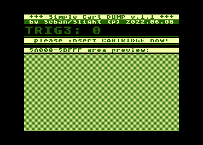

# Simple Cart Dumper #

This program is created to dump 8kB cartridges that located at 0xA000-0xBFFF area of the Atari memory area. Why another cartridge dumper and why is so limited? (only 8k and only one memory area)

This program was designed to dump only one type of cartridge types that was popular in Poland. Those cartridges are mostly used for storing the software for turbo systems for tape recorders.

## How those type of cartridges work? ##

 The cartridge has an single E-PROM chip (EPROM type is 2716, 2732 or 2764, so from 2kB to 8kB) and have an RC timing circuit that disables the cartridge after certain amount of time.

## And what the software do? ##

So this software waits for TRiG3 is stable and active for some period of time, then copies the $A000-$BFFF area to the RAM memory and waits when RC timing circuit turn of the cartridge, than saves to the disk the file with $A000-$BFFF memory content.

If the cartridge is of a type that does not turn off automatically, you can force data writing by pressing SHIFT after a few seconds after inserting the cartridge into the computer port, e.g. when the background turns purple, it means that more than 5 seconds have passed and you can consider that the cartridge is the type that does not turn off by itself.

There are also several cartridge types that can be disabled by accessing any register at $D500-$D5FF area (that imposed ~CCTL signal activity in cartridge port), so this software do a write to each register on $D5xx page after moving $A000-$BFFF area to RAM, to alternatively disable the cartridge of that type.

## License ##

This software uses the freeware [BW-DOS](https://atariwiki.org/wiki/Wiki.jsp?page=BEWE%20DOS%201.30%20Manual), and uses [dmsc mkatr](https://github.com/dmsc/mkatr) program to create the ATR file with BW-DOS and own executable.

The example usage of the software on real hardware can be watched here:

This is free and unencumbered software released into the public domain.

Anyone is free to copy, modify, publish, use, compile, sell, or
distribute this software, either in source code form or as a compiled
binary, for any purpose, commercial or non-commercial, and by any
means.

In jurisdictions that recognize copyright laws, the author or authors
of this software dedicate any and all copyright interest in the
software to the public domain. We make this dedication for the benefit
of the public at large and to the detriment of our heirs and
successors. We intend this dedication to be an overt act of
relinquishment in perpetuity of all present and future rights to this
software under copyright law.

THE SOFTWARE IS PROVIDED "AS IS", WITHOUT WARRANTY OF ANY KIND,
EXPRESS OR IMPLIED, INCLUDING BUT NOT LIMITED TO THE WARRANTIES OF
MERCHANTABILITY, FITNESS FOR A PARTICULAR PURPOSE AND NONINFRINGEMENT.
IN NO EVENT SHALL THE AUTHORS BE LIABLE FOR ANY CLAIM, DAMAGES OR
OTHER LIABILITY, WHETHER IN AN ACTION OF CONTRACT, TORT OR OTHERWISE,
ARISING FROM, OUT OF OR IN CONNECTION WITH THE SOFTWARE OR THE USE OR
OTHER DEALINGS IN THE SOFTWARE.

For more information, please refer to <http://unlicense.org/>